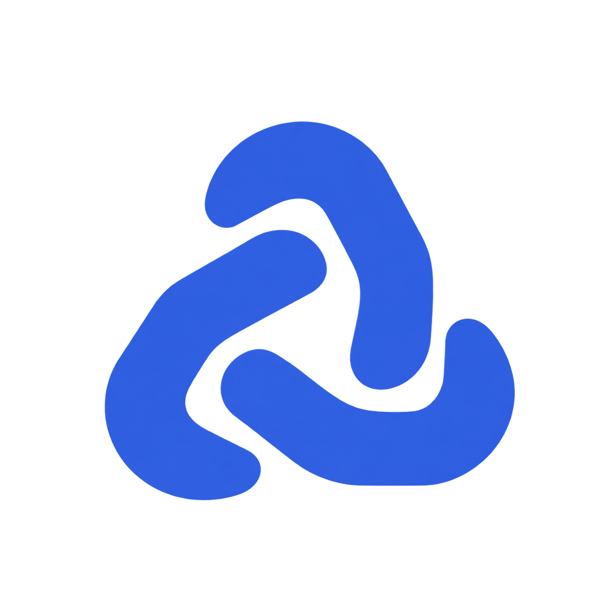
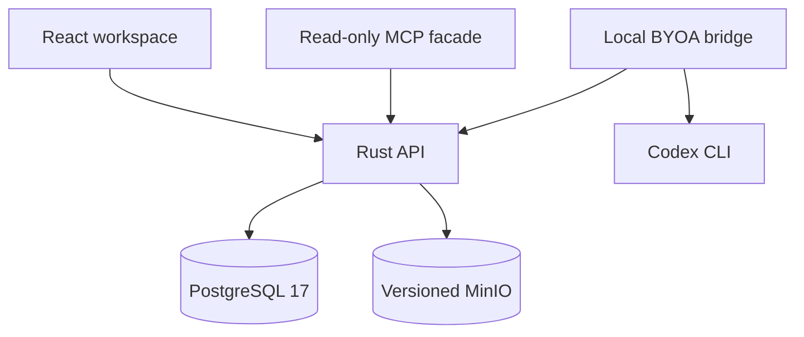

<div align="center">



# Grimoire

**A workspace for product decisions, agent work, and the evidence behind them.**

Describe a product. Prepare a plan. Keep every proposal connected to its sources and revisions.

[Live app](https://grimoire-52-71-93-70.sslip.io) · [Try the demo](https://grimoire-52-71-93-70.sslip.io/demo) · [Get started](#get-started) · [Documentation](#documentation)

</div>

---

Grimoire brings product briefs, agent tasks, evidence, and review into one organization workspace. A **Scion** holds the product being investigated; agents prepare bounded proposals, and people review the resulting work.

Grimoire supports digital capability planning, focused public-web research and synthetic physical-sourcing workflows. It uses a React interface, a Rust API, PostgreSQL 17, and private versioned object storage. Native agent profiles, skills, assignments, and task history belong to Grimoire. A downloadable local connector runs explicitly dispatched tasks through your existing Codex CLI login.

**Status:** active development, with an [AWS deployment](deploy/aws/README.md) and a public demo using saved synthetic examples. Real agent tasks require an authorized local connector. Agent completion never grants human approval; real-world sourcing usefulness remains unvalidated.

## Why Grimoire

A product decision depends on more than an agent's latest response. Requirements change, sources lose permission, and proposals become outdated.

Grimoire keeps that context attached to the work:

- **Revisioned briefs.** Save incomplete drafts, preserve history, and reject conflicting edits without silently overwriting work.
- **Evidence with provenance.** Track source ownership, permission, exact object versions, hashes, and quoted claim locations.
- **Bounded agent work.** Assign preparation tasks with explicit dispatch, runtime limits, cancellation, and recorded results.
- **Separate review.** Keep agent proposals, Handler statements, and human review distinct.
- **Organization workspaces.** Navigate Scions, proposals, tasks, agents, skills, connectors, and activity from one interface.
- **Internal monitoring.** Inspect case dependencies and recorded internal Watchtower activity. External provider monitoring is a separate capability.

## How it works

1. **Create a Scion.** Describe the product and decision. Record known requirements; leave unknowns visible.
2. **Prepare work.** Queue and dispatch a supported agent task. The result stays bound to its input revision.
3. **Inspect evidence.** Review public-research source receipts, or link permitted synthetic sources and record claims against exact source quotations.
4. **Review the result.** Inspect the proposal, its evidence, and unresolved questions together.
5. **Track change.** Use revision history, task activity, and internal dependency views to understand what needs attention.

For example, a workshop website can produce capability hypotheses for hosting, content management, booking requests, and notifications. Those hypotheses identify what to investigate; they do not establish a provider's capabilities or prices.

### Core concepts

| Concept | Purpose |
| --- | --- |
| **Organization** | The workspace and access boundary for people, agents, and records. |
| **Handler** | A signed-in person who supplies intent and works with proposals. Workspace access does not imply sourcing authority. |
| **Scion** | A product brief with immutable revisions and related work. |
| **Task** | A bounded unit of agent preparation, with execution state and provenance. |
| **Proposal** | A revision-bound result awaiting the applicable human review. |
| **Source and claim** | Source content and a separately recorded statement supported by an exact locator. Claims remain unverified. |
| **Watchtower** | The internal monitoring surface for recorded case state and dependencies. |

## Capabilities and boundaries

| Area | Current scope |
| --- | --- |
| Accounts and organizations | Handler signup, sign-in, HttpOnly sessions, isolated organizations, and separate installation-owner setup. |
| Google sign-in | Optional; enabled with a configured Web application client ID. Tokens are verified server-side. |
| Product intake | Incomplete drafts, immutable revisions, history, stale-edit rejection, and idempotent writes. |
| Digital planning | Capability proposals and Handler-authored evidence comparison drafts. Digital vendor comparison is unavailable. |
| Evidence | Synthetic text sources with exact claim locators; public research with bounded page excerpts and retrieval receipts. Source withdrawal hides dependent content. |
| Public research | Explicitly consented Codex web or SerpApi Google research, observed search queries, public URLs and unverified reports. No authenticated scraping or supplier actions. |
| Physical sourcing | Synthetic scope review, explicit supplier offers, and exact two-offer comparison. Missing terms remain missing. |
| Agents | Native profiles, versioned instructions, skills, assignments, pause/resume, and Codex task history. |
| Task conversations | Saved Handler notes, agent replies, and linked follow-up work; see the task-conversation contract. |
| Data access | Organization-scoped intake and source connectors; a read-only local MCP stdio facade. |
| Public demo | A read-only `/demo` entry for separately published, persisted synthetic cases. Operator seeding is required. |
| Commercial actions | Supplier selection, RFQ dispatch, purchases, and sourcing approval are not enabled by these workflows. |

The documented MCP facade uses **stdio**. Do not treat it as a verified Streamable HTTP implementation.

Public research requires a connected research-capable worker and explicit consent for the public brief. The optional SerpApi flow uses Codex to plan bounded queries, SerpApi to discover current public results, server-side page captures, and Codex to synthesize captured evidence with search receipts. Configure `SERPAPI_API_KEY` only on the selected local connector; see [connector setup](byoa/README.md#optional-serpapi-research). Source retrieval establishes what was fetched, not the accuracy of a claim or a supplier's suitability. See the [research contract](docs/public-web-research.md) for limits.

## Get started

To use the hosted app, sign in and open **Settings → Runtime → Connect Codex**. Copy its startup command, or download the Windows connector, then approve the organization in your browser. No source-code checkout is needed. Keep the connector terminal open for agent tasks; Codex authentication stays on your computer. See the [connector guide](byoa/README.md).

For local development, the commands below follow the Windows/PowerShell setup. Run them from the repository root.

### Prerequisites

- PowerShell 7 (`pwsh`).
- Rust and Cargo.
- Node.js and npm, compatible with the checked-in web dependencies.
- PostgreSQL 17, using either the native setup or Docker Desktop with a running Linux engine.
- Private versioned MinIO storage configured using the [object-storage guide](docs/object-storage.md).
- Go 1.23 or newer for the acceptance harness.
- Codex CLI with an existing local login, only if you want live agent preparation.

### 1. Initialize the database

For the native Windows path:

```powershell
pwsh -File scripts/install-local-tools.ps1 -Postgres -Go
pwsh -File scripts/dev.ps1 -Task Init -Mode native
pwsh -File scripts/dev.ps1 -Task DbUp
pwsh -File scripts/dev.ps1 -Task Migrate
```

<details>
<summary>Alternative: PostgreSQL with Docker Compose</summary>

With Docker Desktop running, use this initialization sequence on a fresh checkout:

```powershell
pwsh -File scripts/dev.ps1 -Task Init -Mode docker
pwsh -File scripts/dev.ps1 -Task DbUp
pwsh -File scripts/dev.ps1 -Task Migrate
```

Compose uses `postgres:17` and persistent local storage. This starts the database, not the complete application stack. Switching database modes does not transfer existing data.

</details>

`Init` preserves an existing `.env`. Keep that file private. Database shutdown retains data; deleting volumes does not.

### 2. Start storage and the API

Complete the [local object-storage setup](docs/object-storage.md), then run:

```powershell
pwsh -File scripts/storage.ps1 -Task Up
pwsh -File scripts/dev.ps1 -Task Api
```

### 3. Start the web app

In another terminal:

```powershell
npm.cmd --prefix web ci
npm.cmd --prefix web run dev -- --host 127.0.0.1 --port 5180
```

Open **http://127.0.0.1:5180**, create a Handler account, then an organization and your first Scion. Installation-owner setup is a separate action.

| Local service | Address |
| --- | --- |
| Web workspace | `http://127.0.0.1:5180` |
| API health | `http://127.0.0.1:8080/api/health` |
| PostgreSQL | `127.0.0.1:55432` |

The documented API binds to loopback and checks PostgreSQL version and runtime privileges at startup. These instructions establish a local environment, not a public deployment.

### 4. Enable agent preparation

Using your existing local Codex CLI login:

```powershell
pwsh -NoProfile -File scripts/byoa.ps1 -Mode Check
pwsh -NoProfile -File scripts/byoa.ps1 -Mode Watch
```

Queue a supported task in the workspace and explicitly dispatch it. The worker runs while its process remains alive. Use `-Mode Once` to process one dispatched task and exit.

Codex execution consumes your account usage. The browser receives no Codex credentials, and the bridge does not grant the agent human confirmation authority. See [BYOA setup](docs/byoa-local.md) for task limits and background-worker commands.

## Architecture



**PostgreSQL is canonical.** It stores organization boundaries, immutable revisions, permissions, tasks, and governed relationships. Graph views project application relationships; a graph database is not required.

**Object storage holds source bytes.** PostgreSQL pins the private object version. Rust verifies its hash and length before returning content or resolving a claim locator. Missing or corrupt objects deny content access.

**The API enforces application authority.** The frontend and agent bridge use the Rust boundary; task completion cannot substitute for an authenticated human review.

**Paperclip is a reference, not a runtime dependency.** Grimoire owns its agent and workspace state in Rust/PostgreSQL. Running the application does not require a Paperclip server.

### Repository map

| Path | Responsibility |
| --- | --- |
| `web/` | React/TypeScript workspace and browser interaction. |
| `api/` | Rust HTTP API, validation, authentication, and transactions. |
| `byoa/` | Local coding-agent bridge and its tests. |
| `connectors/` | Local MCP access facade and connector tests. |
| `harness/` | Go acceptance checks against the running stack. |
| `db/gg40/` | Supplied SQL contracts, fixture, and checksum manifest. |
| `db/intake/` | Additive application migrations. |
| `scripts/` | Local setup, migrations, workers, and verification. |
| `docs/` | Contracts, operating instructions, evidence, and known limitations. |

## Data integrity and access

- Saves append revisions. Stale edits fail rather than overwrite another revision.
- Idempotent requests preserve their original effect across retries and API restarts.
- Source permission is checked before content is returned or used. Revocation blocks later access; it cannot retract bytes already copied.
- Claims bind to exact source revisions and UTF-8 byte ranges. A valid hash proves byte integrity, not factual correctness.
- The API uses a restricted PostgreSQL role without ownership, superuser, or RLS-bypass privileges.
- Organization administration grants workspace access, not engineering or commercial approval authority.
- Supplied SQL files remain hash-pinned. The migration ledger rejects changes to already-applied migration bytes.

Use the repository's migration runner instead of reconstructing migration order. The documented Windows branch explicitly excludes unavailable Mac-origin migrations 0035–0037 and uses its own later protections; migration numbers alone do not prove those branches were integrated. See [authority boundaries](docs/windows-adaptive-scion.md#windows-authority-protections-and-unavailable-mac-work).

## Verification

The Go harness exercises the compiled Rust API, PostgreSQL, and object storage. Checks include immutable history, retries, stale edits, organization isolation, revocation, and real API process restarts.

**The following reset commands erase disposable test data.** They are intended for the isolated test environment, not the development database.

```powershell
pwsh -File scripts/storage.ps1 -Task ResetTest
pwsh -File scripts/dev.ps1 -Task ResetTest
pwsh -File scripts/dev.ps1 -Task Harness
pwsh -File scripts/dev.ps1 -Task DbGuards
```

Additional checks:

```powershell
cargo test --manifest-path api/Cargo.toml --locked
cargo fmt --manifest-path api/Cargo.toml -- --check
cargo clippy --manifest-path api/Cargo.toml --all-targets --locked -- -D warnings
node --test byoa/bridge.test.mjs connectors/local-mcp.test.mjs
npm.cmd --prefix web run typecheck
npm.cmd --prefix web run build
```

See [Testing](docs/testing.md) for connector packaging and browser/integration checks. Current deployment records remain in `docs/evidence/`; historical logs and screenshots are available in Git history.

## Documentation

| Guide | Contents |
| --- | --- |
| [Company workspace](docs/company-workspace.md) | Navigation and organization-level work. |
| [Control surface](docs/control-surface.md) | Case graph, internal Watchtower, and task projections. |
| [Native agents](docs/native-agents.md) | Profiles, instructions, skills, assignments, and execution history. |
| [Task conversations](docs/task-conversation.md) | Handler notes, replies, and follow-up tasks. |
| [Adaptive Scions](docs/windows-adaptive-scion.md) | Digital planning, connector boundaries, MCP, and authority protections. |
| [Local BYOA](docs/byoa-local.md) | Codex preparation and worker setup. |
| [Downloadable connector](byoa/README.md) | One-command pairing, local credentials and package verification. |
| [Public web research](docs/public-web-research.md) | Public briefs, source receipts, report review and withdrawal. |
| [Object storage](docs/object-storage.md) | MinIO setup and exact-version source access. |
| [Public demo](docs/judge-access.md) | Seeding and opening the persisted synthetic examples. |
| [Google sign-in](docs/google-sign-in.md) | Optional authentication configuration. |
| [HTTP API](api/README.md) | Request/response contracts and limits. |
| [Acceptance harness](harness/README.md) | Direct harness execution. |
| [Testing](docs/testing.md) | Current verification commands and test boundaries. |
| [AWS deployment](deploy/aws/README.md) | Hosted setup, updates and verification records. |
| [Storage recovery backlog](docs/storage-recovery-backlog.md) | Unverified recovery and lifecycle behavior. |

## Current limitations

The public demo and physical-sourcing workflows use synthetic records. Public research produces unverified reports and bounded excerpts; it does not qualify suppliers, create real offers, send RFQs, place orders or approve sourcing. Digital vendor comparison remains unavailable.

Storage lifecycle work remains open for signed URLs, Object Lock, physical erasure, backup restoration, orphan cleanup, and recovery between object upload and database commit. Internal Watchtower behavior does not establish continuous external-provider monitoring.

Customer utility and demand remain unvalidated. Technical test results describe software behavior within their stated scope.

## Development and contributions

Keep changes focused and include the affected workflow, reproduction steps, and validation results. Database changes should be additive migrations; preserve supplied contract files and existing migration hashes. Include regression evidence when changing organization access, revision handling, permissions, or task authority.

Use synthetic records in examples and bug reports. Exclude `.env` files, credentials, session material, and confidential source content.

## Acknowledgments

[Paperclip](https://github.com/paperclipai/paperclip) informed the workspace and agent-management design. Grimoire's runtime is implemented separately.

## License

Copyright (c) 2026 Vetri Kalanjiyam B.

Grimoire is licensed under the [MIT License](LICENSE). Third-party dependencies and any incorporated third-party code retain their respective licenses and notices.
