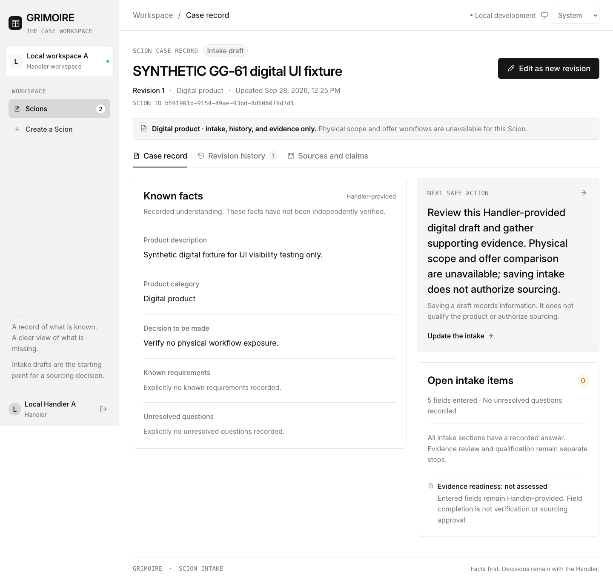

# GG-61 digital Scion browser evidence

Date: 2026-09-28

Repository base: `46f27bef19cea5c2fc4e48bbe57b94faf354ee37`

Path exercised: `#/scions/b591901b-9154-49ae-93bd-8d5060f9d7d1`

This check used a synthetic digital Scion in the disposable GG-61 PostgreSQL database. The real Rust API was running on `127.0.0.1:8080`, Vite served the built UI on `127.0.0.1:5173`, and Playwright drove Chromium against the Scion route.

## Result: PASS

- Visible tabs were exactly `Case record`, `Revision history`, and `Sources and claims`.
- `Physical scope` tabs: 0.
- `Offers` / comparison tabs: 0.
- Physical workflow panels: 0.
- Stale physical next-action copy: 0.
- The UI displayed: “Digital product · intake, history, and evidence only. Physical scope and offer workflows are unavailable for this Scion.”
- The next safe action stayed digital-specific and did not direct the user into exact-scope review or vendor comparison.

This is synthetic software-behavior evidence only. It is not customer evidence and makes no claim about usefulness, demand, or willingness to pay.
