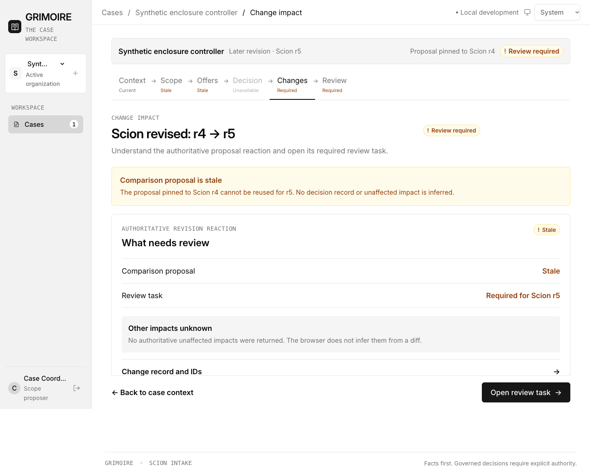
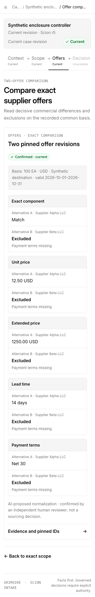

# GG-65 directional frontend verification

## Scope and inherited baseline

- Corrected the bounded directional frontend originally delivered at `c56dfa3c1591b01483355eb9b26a02e514ed9ff0` without resetting the later accepted baseline.
- Reconciled the adverse execution review against the approved GG-64 UX contract revision `a660a125-44da-4778-b9e4-60fee316c886`.
- Browser evidence uses explicit synthetic records shaped to the current Scion, scope, comparison, offer, `/me`/session, and revision-review contracts. It is software-behavior evidence only.

## Corrected source-of-truth and authority behavior

- A confirmed comparison no longer makes Decision current or addressable. Decision remains `Unavailable` because the API returns no decision revision.
- Persisted reactions are named as stale exact-scope or comparison **proposals**. No UI copy calls them decision inputs or infers a current/stale decision.
- Deep decision routes remain a fail-closed explanation only; no visible primary or progress link recommends them.
- Identity labels are derived only from explicit `can_write`, `can_propose_scope`, `can_confirm_scope`, and `is_agent` fields. The bounded labels are Viewer, Intake editor, Scope proposer, Engineering Reviewer, and Proposal agent. Commercial Approver is never inferred.
- The sole forward action comes from a tested state/capability table. Missing, restricted, blocked, stale, proposed, and confirmed scope/comparison states expose zero or one legal primary destination. A confirmed comparison exposes no decision action.
- Comparison Back links now route to the exact scope record, while direct-link fallbacks name case context truthfully.
- Cases, breadcrumbs, `CaseProgress`, and flow Back/forward controls are real links. Route memory restores the originating link focus and scroll position.
- The current review-task contract is required-only. The unreachable completed-task UI/evidence was removed, and both the web contract test and database guard check the canonical `status='required'` constraint plus immutable storage.
- Geometry says `Unknown in this build` because the current API has no availability or rights field.
- Scope, comparison, offers, and revision reactions settle independently. A failed slice is named in a currency warning with a scoped retry; successfully loaded permitted content remains visible, while governed forward actions fail closed until freshness is known.
- Closing the responsive navigation by its backdrop restores focus to `Open navigation` just like Escape.

## Automated verification

Run from `Grimoire-GG61/web` unless noted:

```text
$ npm run typecheck
> tsc -b --pretty false
exit 0

$ npm test
> node --test src/*.test.ts
tests 8 · pass 8 · fail 0

$ npm run build
> tsc -b && vite build
✓ 42 modules transformed.
dist/index.html                   1.50 kB │ gzip:   0.74 kB
dist/assets/index-bVyF7wfC.css   63.70 kB │ gzip:  11.54 kB
dist/assets/index-DlDtjIdJ.js   398.31 kB │ gzip: 112.83 kB
exit 0

$ (cd ../api && cargo test --no-run)
Finished `test` profile; grimoire-api test executable built
exit 0

$ git diff --check
exit 0
```

The eight web tests cover every release-one route, deterministic reaction lookup, fail-closed unknown routes, the state/action table, the explicit capability-label matrix, preservation across each independent read failure, and the required-only database/API task contract.

## Interactive browser verification

Local server:

```text
$ npm run dev -- --port 4173
VITE ready · http://127.0.0.1:4173/
```

Driver command:

```text
$ NODE_PATH=/Users/home/startzy/startzy-ai/agenticflow/paperclip/node_modules/.pnpm/playwright@1.62.1/node_modules \
    node "$PAPERCLIP_RUN_SCRATCH_DIR/gg65-browser-qa.cjs"
{"desktop":"1440x1000","narrow":["390x844","320x800"],"screenshots":["gg65-corrected-change-impact-desktop.png","gg65-corrected-comparison-narrow.png"],"checks":"state, capability, navigation, recovery, focus, semantics, overflow"}
exit 0
```

The driver used local headless Chrome with intercepted current-contract synthetic responses.

Desktop change-impact route, 1440×1000:



- names the authoritative stale object `Comparison proposal`;
- explicitly says no decision record or unaffected impact is inferred;
- Decision progress is unavailable and non-link text;
- exactly one filled primary links to the persisted required review task;
- the review Back link targets the exact change and restores focus to `Open review task`.

Narrow current-comparison route, 390×844:



- confirmed comparison does not imply a decision or expose a decision primary;
- Decision remains unavailable;
- Back targets `/scions/case-1/scope/scope-1` exactly;
- ten labeled mobile alternative/dimension groups render with no page-level overflow at 390 or 320 CSS px;
- the action footer follows content and covers no row or control.

Additional interactive assertions passed:

- Viewer, Intake editor, Scope proposer, Engineering Reviewer, and Proposal agent labels follow only explicit response flags; no profile becomes Commercial Approver.
- Failing scope, comparison, offers, or revision-reviews independently preserves other permitted content, displays `Some case records may be out of date`, and exposes only that slice's retry.
- Missing scope has one `Complete exact scope` primary; blocked scope has no comparison primary.
- `CaseProgress` routes are anchors with exact `href` values; unavailable Decision is not an anchor.
- desktop comparison has one caption, three scoped column headers, and five scoped row headers.
- Details closes on Escape and restores its trigger; navigation backdrop close restores `Open navigation`.
- desktop and both narrow viewports have zero page-level horizontal overflow.

## Residual integration boundary

The current server still lacks canonical decision revisions, explicit Commercial Approver/review-outcome capabilities, idempotent decision/outcome commits, completed outcome readback, and authoritative geometry availability/rights. The frontend keeps those actions and claims unavailable. Enabling them requires a separately reviewed server contract; this correction does not fabricate their results or assert product value.
