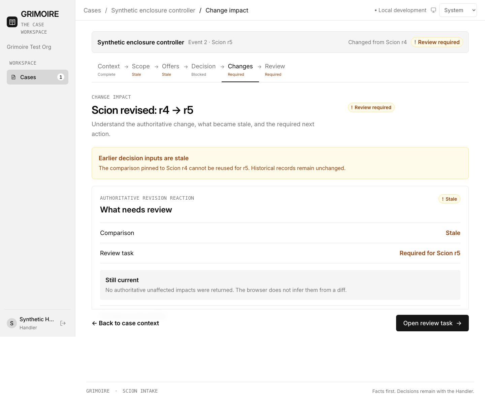
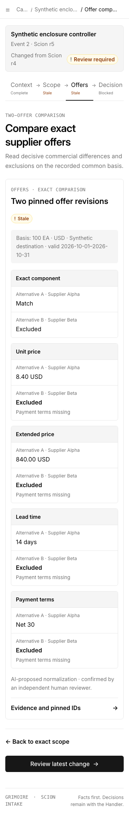

# GG-65 directional frontend verification

## Scope and inherited baseline

- Implemented from the clean `gg61-persisted-revision-monitoring` worktree at `32edc8b122625448a547ddf6e97991214bb9cc0c`.
- Preserved the visual/product reference at `46f27bef19cea5c2fc4e48bbe57b94faf354ee37` and all later accepted GG-61 behavior. No reset, rewind, or unrelated file removal was performed.
- Used the approved GG-64 UX artifact as the screen, route, state, responsive, and accessibility contract.
- Browser evidence below uses explicit synthetic records matching the current API response shapes. It demonstrates software behavior only and is not customer, supplier, or market evidence.

## Implemented behavior

- Replaced physical-case tab state with addressable context, exact-scope, comparison, decision-gate, change-impact, and persisted-review routes.
- Added a minimal 224 px desktop rail, modal drawer below 1180 px, named breadcrumbs/back paths, compact case context, and a six-step case progress control.
- Added read-first exact-scope and semantic two-offer comparison surfaces. Commercial decimal strings are rendered exactly as returned; the browser performs no arithmetic, ranking, winner selection, or unaffected-impact inference.
- Added loading skeleton/slow-read recovery, empty, error, denied, offline/freshness-unknown, stale, and completed-task states.
- Added persisted Scion revision reaction mapping. A stale comparison routes to its exact transition and matching durable `revision_change_review` task.
- Preserved the existing scope/offer workbenches as explicit preparation routes, plus intake edit, source, and immutable history routes.
- Added reusable status, context, progress, state, details-dialog, comparison, notice, and action-footer components.

## Authority boundary and justified deviations

The current inherited API does not expose canonical decision revisions, granular Commercial Approver/review-outcome capabilities, idempotent decision/outcome commits, or canonical completed-outcome readback. Therefore:

- decision and review-outcome routes render `Action unavailable in this build` and a safe named back path;
- no client-only choice is presented as an authorized or recorded decision;
- a persisted revision reaction makes the affected comparison and decision **context** stale, but the UI does not fabricate a historical decision record;
- the mobile action footer is in normal flow on read-only pages, rather than overlaying long comparison content. This preserves the contract's stronger requirement that actions not cover content or inputs. A later real decision/review form can opt into sticky behavior once its server contract exists.

These deviations implement GG-64 section 13's explicit fail-closed integration gate.

## Automated verification

Run from `Grimoire-GG61/web`:

```text
$ npm run typecheck
> tsc -b --pretty false
exit 0

$ npm run build
> tsc -b && vite build
✓ 41 modules transformed.
dist/index.html                   1.50 kB │ gzip:   0.74 kB
dist/assets/index-DJDBUk3S.css   60.17 kB │ gzip:  10.95 kB
dist/assets/index-BmXNzh5X.js   388.92 kB │ gzip: 109.98 kB
✓ built in 510ms

$ npm test
> node --test src/flow-model.test.ts
tests 3 · pass 3 · fail 0

$ git diff --check
exit 0
```

The route/model tests cover every release-one address shape, deterministic newest-reaction selection independent of API ordering, task/change lookup, and fail-closed handling of unknown mutation routes.

## Interactive browser verification

Local server command:

```text
$ npm run dev -- --port 4173
VITE ready · http://127.0.0.1:4173/
```

Browser driver: Playwright Core with local Chromium, using intercepted `/api` responses shaped exactly as the inherited Scion, scope, offer, comparison, and revision-review contracts. Tested light theme at 1440×1000, 390×844, and 320×800 CSS pixels.

Desktop change-impact route, 1440×1000:



- zero page-level horizontal overflow;
- exactly one filled primary action: `Open review task`;
- visible text-plus-symbol `Review required` and `Stale` states;
- persisted transition explains r4 → r5 and routes to the exact task.

Narrow comparison route, 390×844:



- zero page-level horizontal overflow at both 390 and 320 CSS px;
- desktop table hidden and ten labeled mobile alternative/dimension groups rendered;
- exactly one filled primary action;
- excluded/missing evidence remains textually explicit;
- action footer follows content and covers no row or input.

Targeted keyboard and semantic checks:

- drawer opens from `Open navigation`, moves focus to `Grimoire home`, traps Tab, closes on Escape, and restores focus to its trigger;
- Details opens as a native modal dialog, focuses `Close details`, closes on Escape, and restores focus to `Evidence and pinned IDs`;
- focused controls expose a visible 3 px ring;
- desktop comparison has one caption, three scoped column headers, and five scoped row headers;
- mobile comparison uses labeled `dl` groups and keeps state text visible;
- route changes focus the route `h1`; loading and stale changes use polite status announcements, while failures use alerts;
- both screenshots reuse the existing light-theme contrast tokens; warning, success, destructive, focus, and neutral treatments add text/symbol labels and never rely on color alone.

## Residual integration risk

End-to-end recording of Event 1 and an Event 2 review outcome remains server-blocked by the missing canonical contracts named above. The frontend makes that boundary observable and safe; enabling either commit control before those APIs and capability fields exist would violate the accepted authority model.
