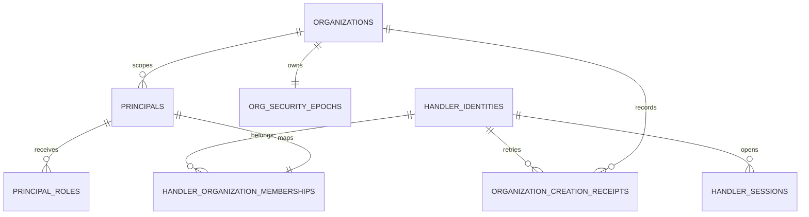

# GG-67 organization onboarding contract and verification

This document records the selected local-installation design, implementation
boundary, and synthetic verification evidence for organization onboarding. It
does not authorize deployment or describe a production identity provider.

## Selected design

- PostgreSQL remains canonical for installation setup, human Handler identity,
  organization membership, active-organization session state, and retry
  receipts. The browser receives only an opaque HttpOnly cookie.
- `installation_setup` is a singleton independent of `organizations`. Existing
  development workspaces A/B therefore do not suppress first-use setup.
- One organization creation transaction writes the organization,
  `org_security_epochs` row, organization-scoped principal, `org_admin` role,
  checked Handler membership, and immutable idempotency receipt. A retry with
  the same key/body returns the original organization; a changed body returns
  `409 IDEMPOTENCY_CONFLICT`.
- The session stores `active_org_id`, but every authentication joins it through
  the live membership, enabled principal, and exact `org_admin` role. Arbitrary
  client organization headers are never read. The switch route accepts an ID
  only as a requested target and updates the session only after that join.
- The seeded bearer path remains for the Go development harness. The React UI
  uses only cookie sessions and contains no `.env` or token-entry path.



```mermaid
sequenceDiagram
  participant B as Browser
  participant R as Rust API
  participant P as PostgreSQL 17
  B->>R: POST /api/setup/owner
  R->>P: lock singleton; create human identity + hashed session
  R-->>B: HttpOnly SameSite=Strict cookie
  B->>R: POST /api/organizations + Idempotency-Key
  R->>P: checked session; atomic org/epoch/principal/role/membership/receipt
  R-->>B: empty active workspace
  B->>R: POST /api/scions + Idempotency-Key
  R->>P: RLS-bound revision 1
  B->>R: POST /api/session/active-organization
  R->>P: update only through checked membership
```

## Authority boundary

`org_admin` is workspace administration, not sourcing authority. Migration
`0035` separates `app.intake_can_manage_workspace()` from the narrowed
`app.intake_can_write()`:

| Operation | New organization owner |
| --- | --- |
| Create/revise a Scion intake | Allowed |
| Read its organization's Scions | Allowed |
| Link source evidence or submit offers | Denied without `procurement_preparer` |
| Prepare/confirm exact engineering scope | Denied without explicit proposer/reviewer enrollment |
| Commercial/sourcing approval | Denied without its separate role and workflow |
| Installation-owner setup as a seeded bearer/agent | Denied |

Session writes require `X-Grimoire-CSRF: 1`; cross-site scripts cannot add that
header without a successful CORS preflight, and the API emits no permissive
CORS policy. Cookies are `HttpOnly; SameSite=Strict; Path=/api`. `Secure` is
intentionally omitted only because this release is loopback HTTP and the API
rejects non-loopback binds.

## HTTP surface

| Method and path | Result / errors |
| --- | --- |
| `GET /api/setup/status` | `200 {setup_required}` |
| `POST /api/setup/owner` | `201 SessionState`; `403` with bearer identity; `409` after setup |
| `POST /api/session/login` | `200 SessionState`; `401` on mismatch |
| `GET /api/session` | Handler, memberships, checked active principal; `401` invalid/expired |
| `DELETE /api/session` | revokes server row and clears cookie |
| `POST /api/organizations` | `201 SessionState`; key required; `409` changed replay |
| `POST /api/session/active-organization` | `200 SessionState`; foreign/unjoined target is generic `404` |

Expired/revoked sessions fail closed. A missing active membership produces
`409 ACTIVE_ORGANIZATION_REQUIRED` on workspace routes. Database/unavailable
outcomes tell clients to retry organization/Scion creation with the same key.
No partial organization is visible because all creation rows and the receipt
commit or roll back together.

## Verification performed (synthetic data only)

Fresh PostgreSQL 17 verification applied unchanged `0022` and `0023`, then all
additive migrations through `0035`. The development seeds produced two
organizations while `app.intake_installation_setup_required()` still returned
true. The live Rust/API exercise then proved:

- seeded agent bearer setup: `403 INSTALLATION_SETUP_IDENTITY_DENIED`;
- owner setup: zero memberships and no active organization;
- same organization request repeated with one key: same UUID, one organization
  row, one receipt;
- owner capabilities: intake write true, scope proposal/confirmation false;
- first Scion: revision 1 persisted;
- second organization: visible Scion count zero;
- switch back: first organization visible Scion count one;
- seeded identity B reading that Scion ID: generic `404`;
- Rust API stop/start with unchanged PostgreSQL and cookie: two memberships and
  the first Scion remained available.
- upgrade check: a PostgreSQL 17 database was built through `0034`, seeded with
  two development organizations and one synthetic Scion, then upgraded by
  `0035`; the result retained 2 organizations, 1 Scion named `Pre-upgrade
  synthetic Scion`, reported setup pending, and exposed the new organization
  creation function.

Repository checks:

```text
cd api && cargo test --locked
cd api && cargo clippy --all-targets --locked -- -D warnings
cd api && cargo fmt --all -- --check
cd web && npm run typecheck
cd web && npm test
cd web && npm run build
cd harness && GOCACHE=<run-scratch>/go-cache GOPATH=<run-scratch>/go go test ./...
```

Results: Rust 16/16 tests passed; strict Clippy and formatting passed; web 8/8
tests, typecheck, and production build passed; the Go harness package compiled
with no test files after downloading its pinned modules. The full live
Go/PostgreSQL/MinIO harness still requires its documented PowerShell/MinIO
runtime and is not represented here as executed.

The reproducible browser command (against a freshly migrated database with the
API and Vite running) was:

```text
cd web
GRIMOIRE_WEB_URL=http://127.0.0.1:4173 npm run test:gg67-browser
```

It completed with `firstScionVisible: true`, five screenshots, and an empty
`consoleErrors` array. It covered owner setup, first organization, empty
workspace, first Scion, second organization, switch back, 1440×1000 desktop,
and 390×844 narrow layouts.

Screenshots:

- [Owner setup, desktop](evidence/gg67-onboarding-desktop.png)
- [First empty workspace, desktop](evidence/gg67-empty-workspace-desktop.png)
- [First Scion form, narrow](evidence/gg67-first-scion-narrow.png)
- [Second empty organization, desktop](evidence/gg67-second-organization-desktop.png)
- [Switched-back first workspace, narrow](evidence/gg67-returned-workspace-narrow.png)

## Failure and operational notes

- PostgreSQL unavailability cannot create a browser-only identity or workspace;
  the user stays on the current step and reuses the same organization key.
- The server stores passphrases only as bcrypt hashes and session tokens only as
  SHA-256 digests. Neither value appears in evidence, logs, or screenshots.
- Session state and Scions survive an API restart because both are canonical
  PostgreSQL rows. Derived frontend state is rebuilt from `/api/session` and
  `/api/scions`.
- No deployment, external service, supplier/customer contact, or production
  identity choice is introduced. A production release would revisit the local
  passphrase mechanism when an explicit external identity-provider requirement
  exists.
