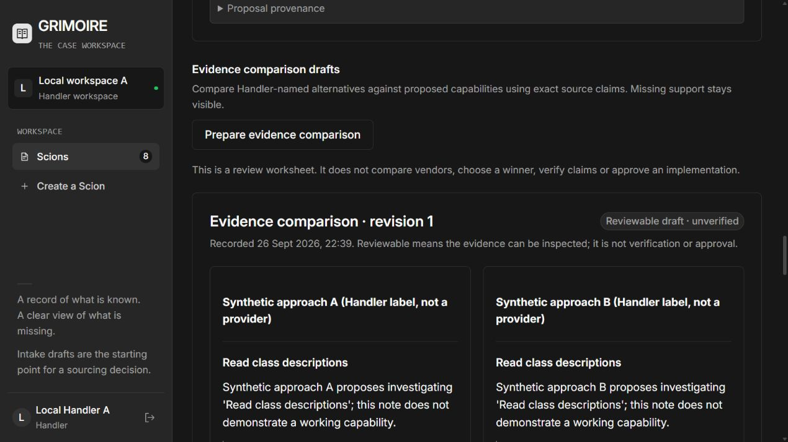
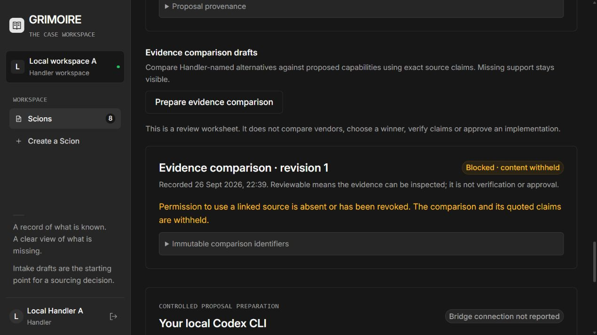

# Windows adaptive Scion verification — 2026-09-26

## Scope and provenance

Implemented on local branch `feature/windows-adaptive-scion`, based on
`572697cdadb20906294fbe6d552b1ad935a7b6de`. The repository is
`C:\proj\Grimoire\grim`. No deployment or remote push is part of this slice.

The earlier available Grimoire GG-46 branch had source head
`e877e648a75d2a2ee6d1b7810cbd69ee9d7ea168` and was merged without rewriting
history as `fde9095965d1bf1e3c0d25f9dc0c93c999cc107d`; the audit is retained in
[integration-audit-2026-09-26.md](integration-audit-2026-09-26.md). Its source
branch and all original commits remain. Paperclip is a separate application
checkout, not an implementation dependency or an approval authority.

The Handler clarified that these references originate from an unavailable Mac:

| Missing source | Reported commit |
| --- | --- |
| GG-54 corrected startup code | `edc0d2080e01c2138c8a16946a2c787d70a862c3` |
| GG-54 evidence | `504748a31ddcc4b535ef5cd5a4ac6b86c4016eaf` |
| GG-53 authenticated approval implementation | `6748bf733c0f8afbfe6605073812e5925093fdec` |
| GG-53 evidence / GG-58 reference | `72e05dc74669030d52a16686e102d438f03dae4c` |

Their source objects, migration `0037_authenticate_approval_sessions.sql`, actual
GG-57 verdict, GG-58 review artifact and GG-54 attachment are unavailable here.
No Mac commit or patch was applied. No exact Mac SQL was reconstructed. Reserve
0035–0037 for reconciliation when their source becomes available. Windows
startup attestation and approval lockdown are new local work, not GG-54/GG-53.

## Implemented behavior

- Handler saves a free-text product description as an ordinary immutable intake
  revision; unknown decision, requirements and questions remain explicit.
- The API pins a capability task to that exact revision and the actual connector
  registry. A Handler dispatches it; the existing bounded, cancellable Codex CLI
  worker submits a leased proposal. Task completion grants no human authority.
- The registry reports two implemented local data paths, `handler_intake` and
  `scion_sources`. There are no enabled external data providers. The local MCP
  stdio interface exposes three read-only tools through authenticated Rust HTTP;
  it is not a third-party connector, crawler, provider catalog or Paperclip bridge.
- Handler-labelled alternatives can reference exact authorized claims against
  proposed capabilities. Missing criteria remain gaps. Source revision, object
  version, SHA-256 and exact UTF-8 locator are checked before content is returned.
  A reviewable comparison is still unverified and grants no sourcing approval.
- Old physical scope, offer, normalization and worker flows remain available.
  New canonical sourcing approval/decision writes are disabled. Runtime access
  to the unverified 0034 helpers is revoked and database triggers reject attempts.
- Startup verifies the exact migration ledger, runtime authority and 2,955
  reviewed catalog hashes, including function bodies, owners, ACLs, column
  definitions/ACLs, policies, constraints and internal FK trigger state.
- Existing governed audit triggers now receive an authenticated role, request
  ID, exact HTTP method/path and raw-body SHA-256. Offer routes no longer replace
  that context with semantic idempotency metadata. New immutable adaptive rows
  retain creator, task, revision and request provenance; this slice does not add
  a new comprehensive audit of every denied HTTP request.

See the [workflow and commands](windows-adaptive-scion.md) and
[API contracts](windows-adaptive-api.md).

## Executed checks

All checks use synthetic data. PostgreSQL is the native Windows **17.11** server
on `127.0.0.1:55432`. MinIO is the real private, versioned local object store on
`127.0.0.1:19000`. Docker Compose was not used or verified in this run.

| Check | Result |
| --- | --- |
| Rust unit tests | 17 passed |
| Codex bridge and MCP Node tests | 17 passed |
| Go adaptive-only black-box checks | 26 passed |
| Full Go Rust/PG17/MinIO/MCP regression | 131 passed; final output retained below |
| Physical offers after the audit correction | 17 passed |
| SQL database/source/scope/worker/offer/adaptive guard scripts | All six passed, rollback-only |
| Fresh and upgraded startup / authority verification | 19 passed |
| Independently queried real-HTTP audit rows | Passed exact hash/path/actor/role/request ID; forged internal headers did not persist |
| Web TypeScript check and production build | Passed |
| Real Codex CLI capability preparation | Completed, recorded below |
| Open browser comparison on revocation | Blocked; quotations and alternative content removed without reload |
| Open browser during API outage/restart | Derived content cleared; exact stored plan/comparison recovered after restart |
| Existing physical case in browser | Two stored offers and prior exact comparison reopened; wrong-part exclusion retained |

Retained outputs: [full 131-check Go run](evidence/windows-adaptive/go-full.log),
[focused adaptive run](evidence/windows-adaptive/go-adaptive.log),
[SQL guards](evidence/windows-adaptive/sql-guards.log),
[19 startup checks and migration hashes](evidence/windows-adaptive/startup-checks.json),
[real HTTP audit verification](evidence/windows-adaptive/http-audit.log), and
[real Codex task result](evidence/windows-adaptive/codex-run.jsonl).
Tracked log copies normalize trailing whitespace; original process logs remain
in ignored `.local` for local inspection.
The final full run completed in 1m51.328s on the rebuilt API including the audit
correction and expanded startup catalog. Its independently checked HTTP request
body hash is `e576978548057ecde94416316209190c730d85e82901b4882caa43bd6bb60432`.

The Go suite starts and restarts a real Rust subprocess against `grimoire_test`.
It includes the previous 105 checks plus 26 adaptive checks, preserving physical
workflow coverage. It tests stale writes and dispatch, immutable rows/history,
idempotent retries, leases and cancellation, cross-organization/case hiding,
missing rights, revoked or stale sources, versioned object/hash checks, and real
MCP stdio initialization, tool discovery and revoked-source behavior. Protocol
fixtures in Go are explicitly synthetic; they are not presented as model output.

Startup checks use a fresh `grimoire_startup_clean_test` (no contract fixture) and
the upgraded existing `grimoire_test`. Mutations are isolated to the clean test
database and restored: same-name function replacement with unchanged ledger,
ledger hash tampering, runtime CREATE, unverified approval-helper EXECUTE,
column-level UPDATE, and disabled internal foreign-key enforcement. Recovery
is rechecked after each. This is startup drift detection for the attested
catalog, not continuous monitoring or protection from a host administrator who
can replace the application and its compiled baseline.

The legacy GG-46 success harness is not an acceptance test for authenticated
approval sessions. The Windows approval path is deliberately disabled; the new
suite verifies denial instead. No unavailable Mac GG-53/GG-54 tests were run.

## Real digital demonstration

- Scion: `1667c0ad-2d9c-473c-898a-9be0b8fe37a6`, revision **1**.
- Dispatched task: `5340cc4b-88b0-492f-808b-51f34ecdc4bd`.
- Agent plan: `f3ade4e1-5fba-4d2b-9618-7b9ab6433b06`.
- Recorded Codex run: `01a0deb1-332e-71f3-856b-056b9e432dab`.
- Output SHA-256: `7aba86102cf2b68b56f7ef803c2da2866101836349a5f7e7319ee2869d44ad2f`.
- Completed **2026-09-26 17:09:35.993 UTC**, within its 240-second limit.
- Comparison: `936d9021-eb1f-4153-afff-e9ef7baaa7a5`.

The Handler description requests a synthetic pottery workshop website. Codex
proposed five capabilities: class descriptions, place requests, organiser
contact, Handler page editing and handling enquiry information. It preserved
unknown budget, privacy requirements, booking rules and missing intake fields.
The model used the existing local login and no external tools. No source text,
browser credential, database password or object-store key was given to it.

Two explicitly synthetic Handler-authored notes were stored in versioned MinIO.
Each quotation occupies UTF-8 `[86, 209)` and says only that an approach proposes
investigating a capability; it does not claim a working implementation. All
other criteria remain unsupported. Source A was then revoked while the
comparison tab remained open. The API returned blocked metadata and the browser
removed both alternatives and quotations while retaining the intake-only plan.
The saved demonstration intentionally ends with that blocked comparison.

The UI rechecks every two seconds while visible and clears derived content when
its access lease expires, at most five seconds from the start of the last
successful check. This is not instantaneous revocation. Audit identifiers and
permitted metadata remain; revocation is not deletion.

Open the [local demonstration](http://127.0.0.1:5180/#/scions/1667c0ad-2d9c-473c-898a-9be0b8fe37a6)
and choose **Capability plan**. The existing physical Scions remain in the list.

## Applied migration bytes

Development, upgraded test and fresh startup databases received the same
unchanged chain: `0022 → 0023 → 0024…0034 → 0038 → 0039`.
No fixture was loaded into development. Original SQL and Paperclip working
files were compared with the pre-integration SHA-256 snapshots.
All 13 original SQL files and all 10 modified/untracked Paperclip files matched
their initial byte hashes; Paperclip's Git status was unchanged.

| Migration | SHA-256 |
| --- | --- |
| 0022 | `5af2c09b31f1be6b537fba05b7af7c561e4b7e959849532bbed43a8d8de4205b` |
| 0023 | `9f7012c8ea6f9e0a32395fa9e569b6f83bff8bbbb7b36862e2a80523b4e82df9` |
| 0034 | `e2f6b91136c7080b50bec92a0a68ce6126b01e243c48615f02f04c1a49508992` |
| New Windows 0038 | `feef24d27f0074ee1b833b548dabc71cfdb7155bd39ba807624e8a3bab6d9199` |
| New Windows 0039 | `c32cab68e3d88e7d697680c3fba6f82f0e7dd5d5d5e3133e2415d98f04b659a2` |

The retained startup JSON contains every applied filename/hash and individual
startup result. New intake migrations are not part of the verified GG-40 package.

## Changed implementation files

| Area | Files |
| --- | --- |
| Rust domain/API | `api/src/capabilities.rs`, `byoa.rs`, `domain.rs`, `main.rs`, `error.rs`, `offers.rs`, `attestation.rs` |
| Additive database work | `db/intake/0038_windows_adaptive_plans.sql`, `0039_windows_approval_lockdown.sql`; catalog query and trusted hash map |
| Agent and connector boundary | `byoa/bridge.mjs`, `bridge.test.mjs`, `connectors/local-mcp.mjs`, `local-mcp.test.mjs` |
| React UI | `web/src/AdaptiveScion.tsx`, `adaptive-api.ts`, `adaptive.css`; case tabs and task navigation in `App.tsx`, `AgentTasks.tsx`, `PhysicalScope.tsx`, `Offers.tsx`, `scope-api.ts` |
| Verification | Go adaptive/MCP/audit checks, three new SQL guard scripts, startup/audit PowerShell scripts, retained synthetic evidence |
| Operations/docs | `scripts/dev.ps1`, `scripts/adaptive-demo.ps1`, README, workflow/API/verification docs and historical audit addendum |

## Remaining work

Reconcile the unavailable Mac implementation and actual independent review
artifacts before enabling any authenticated sourcing approval path. No qualified
reviewer, real customer validation, supplier discovery or commercial offer was
produced by this adaptive demonstration. No RFQs were sent.

External connector configuration, provider access grants and real external
evidence acquisition remain unimplemented. MCP is local read-only access, and
the capability-planning model deliberately has its tools disabled. Paperclip
multi-agent integration remains separate.

Storage upload crash recovery, orphan cleanup, coordinated database/object
restore, physical erasure, Object Lock, cloud parity and signed browser URL
expiry/revocation remain untested. No browser object URLs are issued. Before real
data, decide which roles may see retained audit metadata. The previously blocked
synthetic temporary folder remains untouched.
